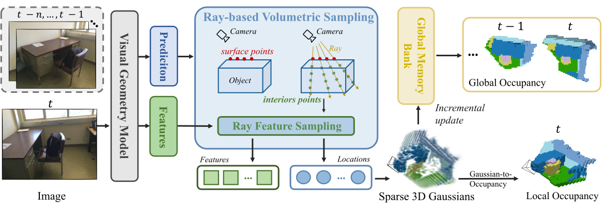
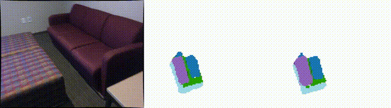
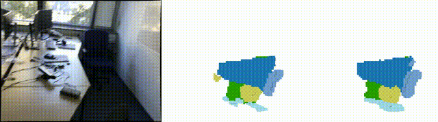

<h1 align="center">GPOcc: Generalizing Visual Geometry Priors to Sparse Gaussian Occupancy Prediction</h1>

<p align="center">
  
  <a href="https://arxiv.org/abs/2602.21552">
    
  </a>
</p>

<p align="center"><strong>
    <a href="https://scholar.google.com/citations?user=FZ3jPs4AAAAJ">Changqing Zhou</a><sup>1</sup>,
    <a href="https://scholar.google.com.hk/citations?user=B588EyYAAAAJ">Yueru Luo</a><sup>2</sup>,
    <a href="https://scholar.google.com/citations?user=OqlY-98AAAAJ">Changhao Chen</a><sup>1 ✉</sup>
</strong></p>

<p align="center"><strong>
    <sup>1</sup>The Hong Kong University of Science and Technology (Guangzhou)<br>
    <sup>2</sup>The Chinese University of Hong Kong, Shenzhen
</strong></p>

<p align="center"><sub>✉ Corresponding author.</sub></p>

<p align="center"><strong>
    <a href="https://juivyy.github.io/gpocc/">Project Page</a> |
    <a href="https://arxiv.org/abs/2602.21552">Paper</a>
</strong></p>

<p align="center">
  
</p>

> **GPOcc** leverages generalizable visual geometry priors, such as VGGT, and represents volumetric evidence as **sparse 3D Gaussians** for efficient **monocular 3D occupancy prediction**. It further supports streaming embodied perception with an incremental fusion strategy for online scene understanding.

## News

- [2026.05] Code is released.
- [2026.02] :tada: **GPOcc was accepted to CVPR 2026.**

## Overview

GPOcc generalizes powerful visual geometry priors to sparse Gaussian occupancy prediction. The core idea is to lift monocular observations into sparse 3D Gaussian scene elements and aggregate them into occupancy-aware scene representations for downstream prediction.

## Getting Started

1. Follow [`docs/install.md`](docs/install.md) to prepare the environment.
2. Follow [`docs/data.md`](docs/data.md) to organize datasets.
3. Follow [`docs/train_eval.md`](docs/train_eval.md) to launch training and evaluation.

## Demos

<p align="center">
  
</p>

<p align="center">
  
</p>

## Citation

If you find this work useful, please consider citing:

```bibtex
@misc{zhou2026generalizingvisualgeometrypriors,
      title={Generalizing Visual Geometry Priors to Sparse Gaussian Occupancy Prediction},
      author={Changqing Zhou and Yueru Luo and Changhao Chen},
      year={2026},
      eprint={2602.21552},
      archivePrefix={arXiv},
      primaryClass={cs.CV},
      url={https://arxiv.org/abs/2602.21552},
}
```

## Related Projects

We recommend checking out the following related projects:

- [EmbodiedOcc: Embodied 3D Occupancy Prediction for Vision-based Online Scene Understanding](https://github.com/YkiWu/EmbodiedOcc/tree/main)
- [LegoOcc: Monocular Open Vocabulary Occupancy Prediction for Indoor Scenes](https://github.com/JuIvyy/LegoOcc)
- [FreeOcc: Training-Free Embodied Open-Vocabulary Occupancy Prediction](https://github.com/the-masses/FreeOcc)
